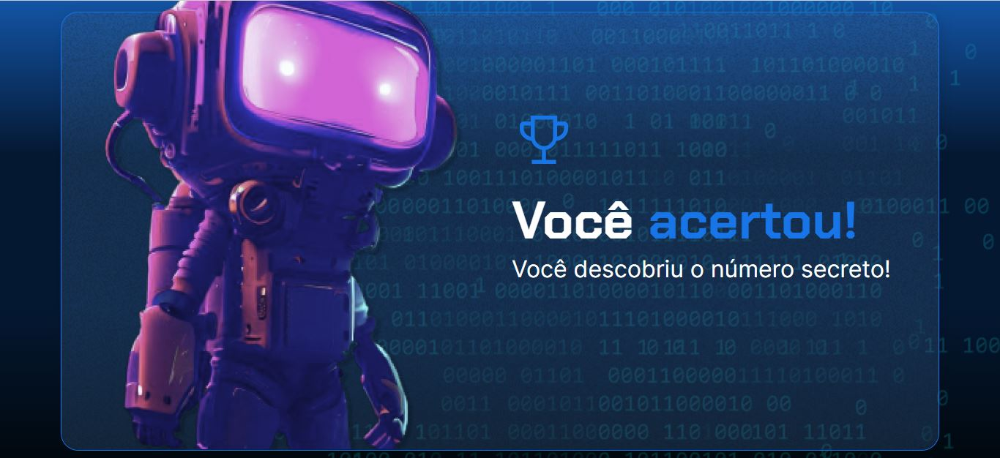

<h1 align="center"> Jogo número secreto </h1>

  <a href="#-tecnologias">Tecnologias</a>&nbsp;&nbsp;&nbsp;|&nbsp;&nbsp;&nbsp;
  <a href="#-projeto">Projeto</a>&nbsp;&nbsp;&nbsp;|&nbsp;&nbsp;&nbsp;
  <a href="#-layout">Layout</a>&nbsp;&nbsp;&nbsp;|&nbsp;&nbsp;&nbsp;
  <a href="#memo-licença">Licença</a>

  

 

  

## 🚀 Tecnologias

Esse projeto foi desenvolvido com as seguintes tecnologias:

- HTML e CSS
- Javascript

## 💻 Projeto

O Projeto do jogo do número secreto, é um jogo que o usuário tem que descobrir qual é esse número.

- [Assistir aulas Alura](https://www.alura.com.br)

## :memo: Licença

Esse projeto está sob a licença MIT.